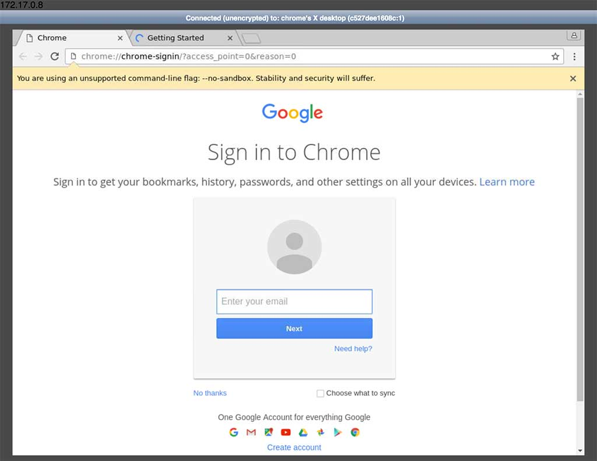

# chrome-as-a-service
Simple example of using Docker with Golang to create chrome-as-a-service.

# Requirements
* Docker >= 1.10
* Golang >= 1.7

# Installation

```bash
# generate SSH public/private key pair for debugging purposes
ssh-keygen -f ./id_rsa

# build docker image
docker build -t caas .

# get Go packages
go get
```

# Usage
You can start the web server with the following command:
```bash
go run main.go
```
Now when you visit [http://localhost:8080/new](http://localhost:8080/new) you should see something like this:


### SSH access
For debugging purposes you can access created Docker container via:
```bash
ssh root@172.17.0.8 -i id_rsa
```
where 172.17.0.8 is the IP of the container displayed on the web page.
